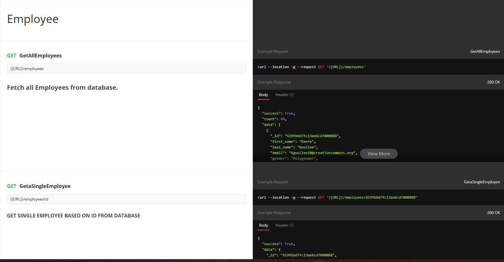
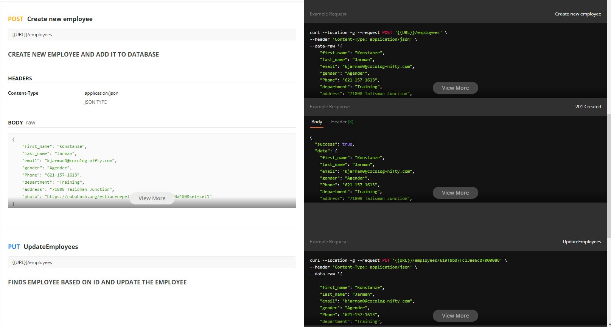
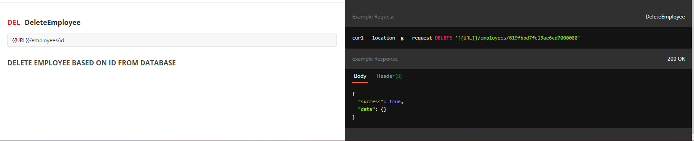

# All operations for Employee management 
### fetch all employees and get single employees
http://localhost:5000 is the server name 

### create and update employee

### delete employee 

[Link to documenttion](https://documenter.getpostman.com/view/16936580/UVJhDF4J)
